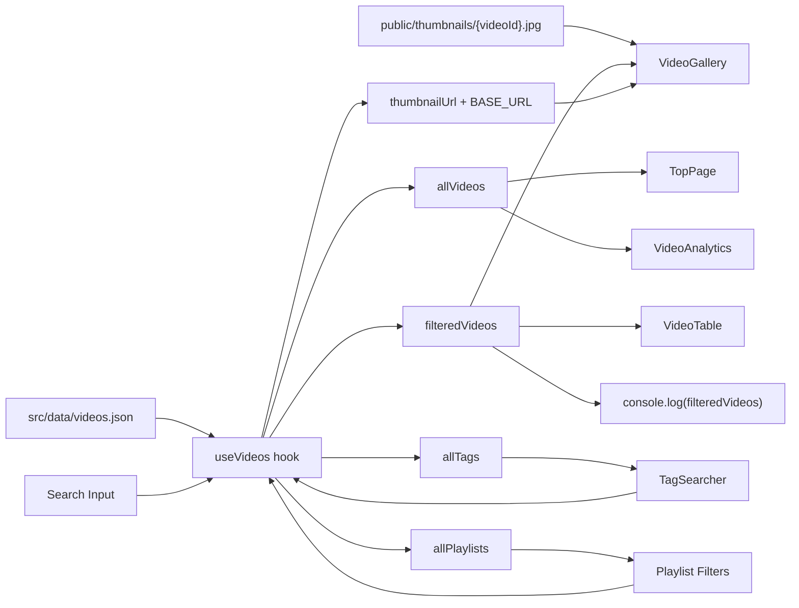
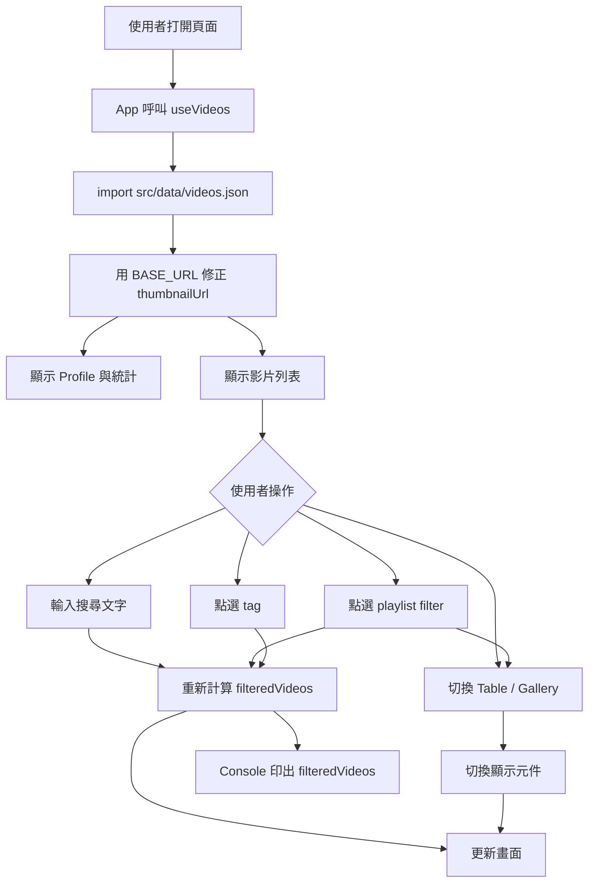

# Himari Profile React Data Flow

這份文件對應 Notion 設計書的 Phase 2：Profile + Video Block。

## 資料流

1. `src/data/videos.json`
   前端主要影片資料來源，透過 TypeScript import 打包進 app。每筆資料包含 `id`、`date`、`title`、`url`、`videoId`、`thumbnailUrl`、`playlist`、`tags`、`collab`、`duration` 等欄位。

   - 目前不使用 `public/videos.json`
   - `thumbnailUrl` 使用 `/thumbnails/{videoId}.jpg` 格式
   - 資料若要更新，應先更新這份 JSON，避免多份資料源不同步

2. `public/thumbnails/`
   公開靜態縮圖資料夾。檔名固定使用 YouTube `videoId`：

   ```text
   public/thumbnails/{videoId}.jpg
   ```

   這些檔案會在 Vite build 時原樣複製到 `dist/thumbnails/`。因為專案的 `vite.config.ts` 設定了：

   ```ts
   base: '/vite-vtb-himari-profile/'
   ```

   所以部署後縮圖實際 URL 會是：

   ```text
   /vite-vtb-himari-profile/thumbnails/{videoId}.jpg
   ```

   `useVideos` 會用 `import.meta.env.BASE_URL` 將 JSON 內的 `/thumbnails/...` 轉成正確部署路徑。

3. `src/hooks/useVideos.ts`
   集中處理影片資料狀態。

   - 讀取 `videos.json`
   - 替 `thumbnailUrl` 補上 Vite `BASE_URL`
   - 建立 `allVideos`
   - 建立 `allTags`
   - 建立 `allPlaylists`
   - 管理 `search`
   - 管理 `selectedTags`
   - 管理 `selectedPlaylists`
   - 產生 `filteredVideos`

4. `src/App.tsx`
   頁面總控制器。

   - 呼叫 `useVideos()`
   - 將 `allVideos` 傳給 `TopPage` 與 `VideoAnalytics`
   - 將 `filteredVideos` 傳給 `VideoTable` 或 `VideoGallery`
   - 將 `allTags`、`selectedTags`、`toggleTag` 傳給 `TagSearcher`
   - 在 `useEffect` 裡執行 `console.log(filteredVideos)`

5. Components

   - `TopPage`: 顯示主視覺、Profile 概要、影片統計
   - `VideoTable`: 表格形式顯示影片
   - `VideoGallery`: 卡片形式顯示影片
   - `TagSearcher`: tag 選取與篩選入口
   - `VideoAnalytics`: playlist 分布統計
   - `FanartPreview`: Phase 4 預留區塊
   - `RelatedLinks`: 外部連結

## Console Log 寫法

`filteredVideos` 是 hook 算出來的資料，所以必須先在 `App.tsx` 呼叫 `useVideos()`。

```tsx
const { filteredVideos } = useVideos()

useEffect(() => {
  console.log(filteredVideos)
}, [filteredVideos])
```

這樣每次搜尋文字、tag、playlist 改變時，Console 都會印出最新的篩選結果。

## Mermaid 資料流圖



## 使用者操作流程圖



## 靜態資源規則

- `src/data/videos.json`: app 主要資料，透過 import 使用，不提供固定 `/videos.json` 公開入口。
- `public/thumbnails`: 公開圖片資源，給 `` 直接載入。
- `public` 內的檔案都可被使用者直接存取，不應放私人 URL 備份或不想公開的資料。
- 如果未來要把 `videos.json` 改放 `public/videos.json`，`useVideos` 需要改成 `fetch()` 並加入 loading / error 狀態。

## Phase 對應

目前已接上的區塊：

- Phase 2: TopPage
- Phase 2: VideoTable
- Phase 2: VideoGallery
- Phase 2: VideoAnalytics
- Phase 3 前置: TagSearcher 可篩選 tag
- Phase 4 預留: FanartPreview
- Phase 5 前置: RelatedLinks
