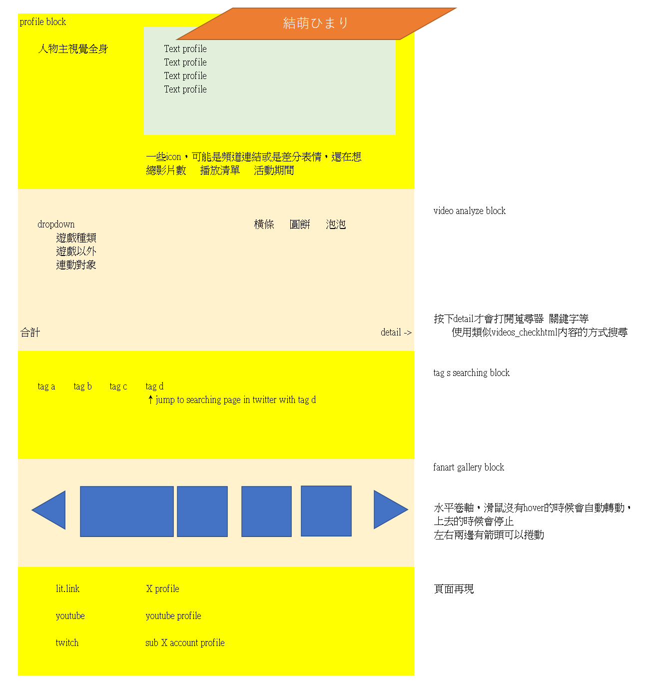

# Docs Index

這裡整理專案內的設計書、資料規格、roadmap、草圖與參考資料。

建議先從 `00-overview/product-design.md` 看整體方向，再看 Top 區塊設計與資料模型。

## 推薦閱讀順序

0. [Design Doc Map](design-doc-map.md)
   - 設計書地圖，用來快速判斷要看哪份文件。

1. [Product Design](00-overview/product-design.md)
   - 專案目標、頁面區塊、元件設計、色票與尚未定義的規格。

2. [Top Visual Block Design](01-top-visual/top-visual-block-design.md)
   - Top/Profile 區塊的畫面設計、版面與 UI 元素規劃。

3. [Top Visual Data Design](01-top-visual/top-visual-data-design.md)
   - Top/Profile 區塊需要的資料、欄位來源與顯示規則。

4. [Data Model](00-overview/data-model.md)
   - `videos.json` 目標 schema、欄位遷移方向、tag/collab 規則。

5. [Roadmap](00-overview/roadmap.md)
   - Phase 切分、發布順序與各階段完成條件。

6. [Data Flow](00-overview/data-flow.md)
   - 目前 React app 的資料流、hook、components 與縮圖路徑處理。

## 00 Overview

| 檔案 | 用途 |
| --- | --- |
| [00-overview/product-design.md](00-overview/product-design.md) | 主設計書快照，整理 Notion 的核心規格。 |
| [00-overview/data-model.md](00-overview/data-model.md) | 影片資料 schema 與資料清理方向。 |
| [00-overview/roadmap.md](00-overview/roadmap.md) | 實作階段、發布順序與高優先缺口。 |
| [00-overview/data-flow.md](00-overview/data-flow.md) | 目前 app 的資料流與 component 串接方式。 |

## 01 Top Visual

| 檔案 | 用途 |
| --- | --- |
| [01-top-visual/README.md](01-top-visual/README.md) | Top/Profile 區塊設計資料夾索引。 |
| [01-top-visual/top-visual-block-design.md](01-top-visual/top-visual-block-design.md) | Top/Profile 區塊的 UI 設計說明。 |
| [01-top-visual/top-visual-data-design.md](01-top-visual/top-visual-data-design.md) | Top/Profile 區塊的資料需求與欄位設計。 |
| [01-top-visual/top-section-design.pptx](01-top-visual/top-section-design.pptx) | Top 區塊設計簡報原始檔。 |
| [01-top-visual/assets/top-section-design.png](01-top-visual/assets/top-section-design.png) | Top 區塊設計圖預覽。 |

### Top 區塊設計圖

## Wireframe / 原始草稿

| 檔案 | 用途 |
| --- | --- |
| [framework.png](framework.png) | 全頁 wireframe 圖片預覽。 |
| [design.xlsx](design.xlsx) | 原始 wireframe Excel 草稿。 |

### 全頁 Wireframe

## 參考資料

| 位置 | 用途 |
| --- | --- |
| [ref/README.md](ref/README.md) | `docs/ref/` 內容說明。 |
| [ref/chart_design.html](ref/chart_design.html) | 舊版分析圖設計參考。 |
| [ref/himari_archive_react_preview.html](ref/himari_archive_react_preview.html) | 舊版 React 風格預覽。 |
| [ref/videos_check.html](ref/videos_check.html) | `videos.json` 檢查報告 HTML。 |
| [ref/python/](ref/python/) | YouTube 資料取得、轉換、檢查與縮圖下載腳本。 |

## 外部來源

- [Notion source](https://www.notion.so/React-35254a9cebff81df8fc7c1fc381d26b4)
- [GitHub Pages](https://hsiao93524.github.io/vite-vtb-himari-profile/)
- [GitHub Pages deployments](https://github.com/hsiao93524/vite-vtb-himari-profile/deployments/github-pages)
