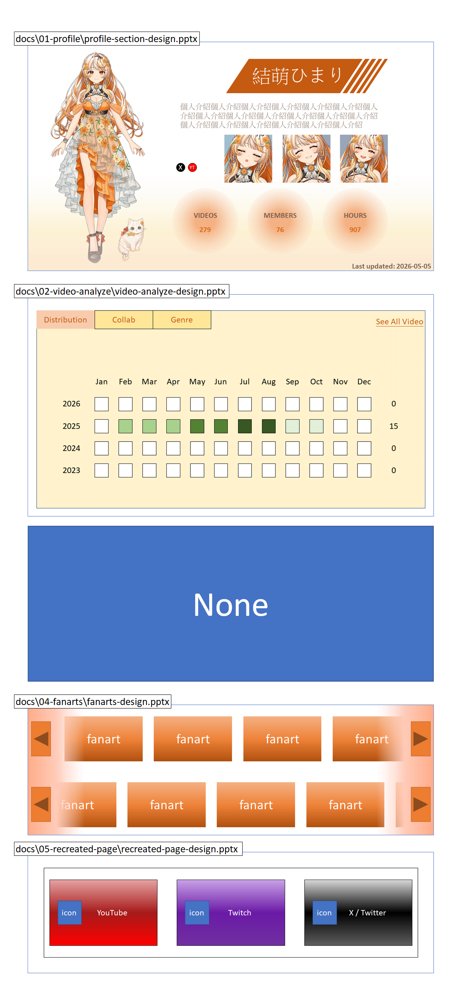

# Docs Index

This folder keeps the design docs, data notes, wireframes, and reference files for this project.

Start with [Product Design](00-overview/product-design.md) for the overall direction. Then read each numbered block folder when you need details for one page section.

## Quick Links

| Goal | Start Here |
| --- | --- |
| Understand the full product direction | [Product Design](00-overview/product-design.md) |
| Read Profile docs | [Profile Docs](01-profile/README.md) |
| Read Video Analyze docs | Preparing... |
| Read X Tag Searcher docs | [X Tag Searcher Docs](03-tag-searcher/README.md) |
| Read Fanarts docs | Preparing... |
| Read Recreated Page docs | Preparing... |
| See the live site | [GitHub Pages](https://hsiao93524.github.io/vite-vtb-himari-profile/) |

## Overall Framework Preview



| File | Purpose |
| --- | --- |
| [00-overview/design.xlsx](00-overview/design.xlsx) | Original wireframe workbook. |
| [00-overview/assets/00-rough-draft.png](00-overview/assets/00-rough-draft.png) | First rough page draft. |
| [00-overview/assets/01-framework.png](00-overview/assets/01-framework.png) | Full page framework wireframe. |

## Folder Map

```text
docs/
├── README.md
├── 00-overview/
│   ├── product-design.md
│   ├── design.xlsx
│   └── assets/
│       ├── 00-rough-draft.png
│       └── 01-framework.png
├── 01-profile/
│   ├── README.md
│   ├── profile-block-design.md
│   ├── profile-data-design.md
│   ├── profile-checklist.md
│   ├── profile-section-design.pptx
│   └── assets/
├── 02-video-analyze/
│   ├── video-analyze-design.pptx
│   └── assets/
├── 03-tag-searcher/
│   ├── README.md
│   ├── tag-searcher-block-design.md
│   ├── tag-searcher-data-design.md
│   ├── tag-searcher-checklist.md
│   └── tag-searcher-migration-checklist.md
├── 04-fanarts/
│   ├── fanarts-design.pptx
│   └── assets/
├── 05-recreated-page/
│   ├── recreated-page-design.pptx
│   └── assets/
├── ref/
```

## Design Docs

### 00 Overview

| File | Purpose |
| --- | --- |
| [00-overview/product-design.md](00-overview/product-design.md) | Main product design snapshot and project direction. |

### 01 Profile


| File | Purpose |
| --- | --- |
| [01-profile/README.md](01-profile/README.md) | Profile docs index. |
| [01-profile/profile-block-design.md](01-profile/profile-block-design.md) | Profile UI and layout notes. |
| [01-profile/profile-data-design.md](01-profile/profile-data-design.md) | Profile data fields and data rules. |
| [01-profile/profile-checklist.md](01-profile/profile-checklist.md) | Profile acceptance checklist. |
| [01-profile/profile-section-design.pptx](01-profile/profile-section-design.pptx) | Profile source design deck. |
| [01-profile/assets/profile-section-design.png](01-profile/assets/profile-section-design.png) | Profile design preview image. |

### 02 Video Analyze

| File | Purpose |
| --- | --- |
| [02-video-analyze/video-analyze-design.pptx](02-video-analyze/video-analyze-design.pptx) | Video Analyze source design deck. |
| [02-video-analyze/assets/](02-video-analyze/assets/) | Video Analyze slide preview images. |

### 03 X Tag Searcher

| File | Purpose |
| --- | --- |
| [03-tag-searcher/README.md](03-tag-searcher/README.md) | X Tag Searcher docs index. |
| [03-tag-searcher/tag-searcher-block-design.md](03-tag-searcher/tag-searcher-block-design.md) | X Tag Searcher UI, layout, and X search behavior. |
| [03-tag-searcher/tag-searcher-data-design.md](03-tag-searcher/tag-searcher-data-design.md) | JSON schema, categories, and tag data rules. |
| [03-tag-searcher/tag-searcher-checklist.md](03-tag-searcher/tag-searcher-checklist.md) | X Tag Searcher acceptance checklist. |
| [03-tag-searcher/tag-searcher-migration-checklist.md](03-tag-searcher/tag-searcher-migration-checklist.md) | Migration checklist for splitting video tag filters from X search handoff. |

### 04 Fanarts

| File | Purpose |
| --- | --- |
| [04-fanarts/fanarts-design.pptx](04-fanarts/fanarts-design.pptx) | Fanarts source design deck. |
| [04-fanarts/assets/](04-fanarts/assets/) | Fanarts slide preview images. |

### 05 Recreated Pages

| File | Purpose |
| --- | --- |
| [05-recreated-page/recreated-page-design.pptx](05-recreated-page/recreated-page-design.pptx) | Recreated Pages source design deck. |
| [05-recreated-page/assets/](05-recreated-page/assets/) | Recreated Pages slide preview images. |

## References

| File | Purpose |
| --- | --- |
| [ref/README.md](ref/README.md) | Reference file index. |
