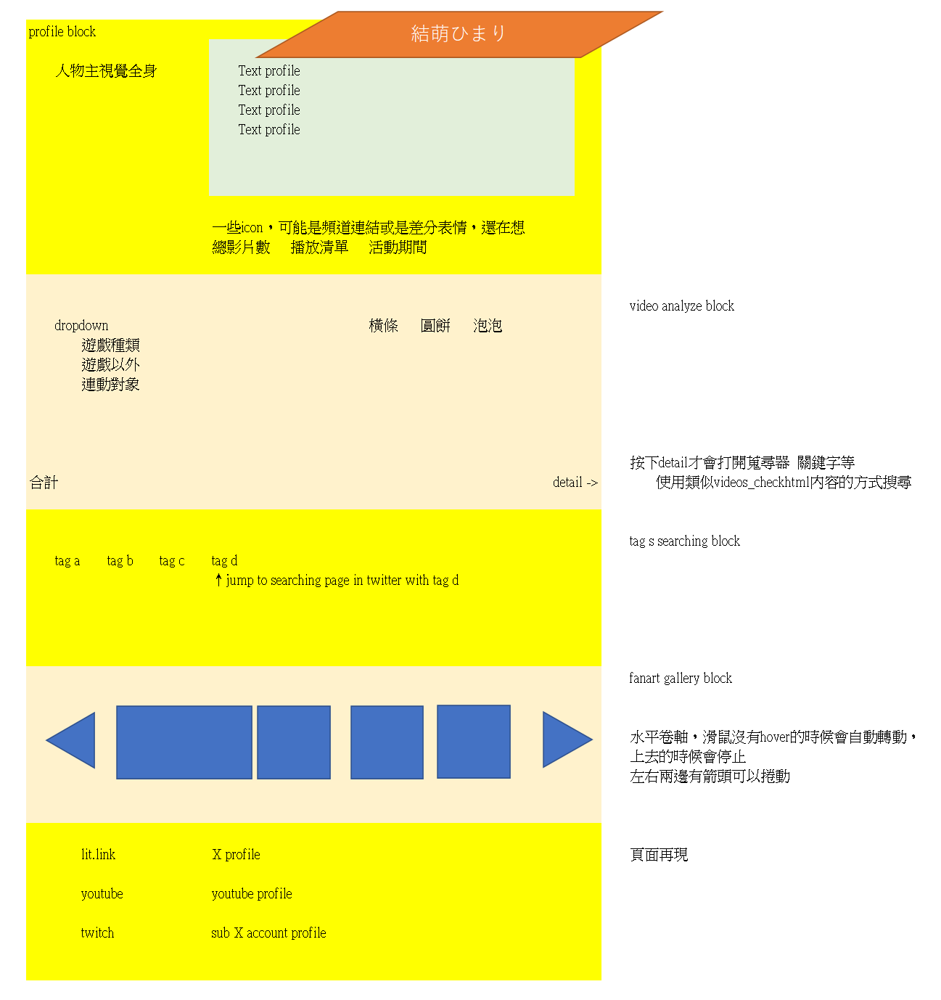

# Docs Index

這裡整理專案內的設計書、資料規格、草圖與參考資料。

建議先從 `00-overview/product-design.md` 看現行整體方向，再看各 block 的設計文件。

## 00 Overview

| 檔案 | 用途 |
| --- | --- |
| [00-overview/product-design.md](00-overview/product-design.md) | 主設計書快照，整理 Notion 的核心規格。 |

## 01 Profile

| 檔案 | 用途 |
| --- | --- |
| [01-profile/README.md](01-profile/README.md) | Profile 區塊設計資料夾索引。 |
| [01-profile/profile-block-design.md](01-profile/profile-block-design.md) | Profile 區塊的 UI 設計說明。 |
| [01-profile/profile-data-design.md](01-profile/profile-data-design.md) | Profile 區塊的資料需求與欄位設計。 |
| [01-profile/profile-checklist.md](01-profile/profile-checklist.md) | Profile 實作完成後的驗收清單。 |
| [01-profile/profile-section-design.pptx](01-profile/profile-section-design.pptx) | Profile 區塊設計簡報原始檔。 |
| [01-profile/assets/profile-section-design.png](01-profile/assets/profile-section-design.png) | Profile 區塊設計圖預覽。 |

### Profile 區塊設計圖

## 03 X Tag Searcher

| 檔案 | 用途 |
| --- | --- |
| [03-tag-searcher/README.md](03-tag-searcher/README.md) | X Tag Searcher 區塊設計資料夾索引。 |
| [03-tag-searcher/tag-searcher-block-design.md](03-tag-searcher/tag-searcher-block-design.md) | X Tag Searcher 區塊的 UI、layout 與 X / Twitter 搜尋互動規格。 |
| [03-tag-searcher/tag-searcher-data-design.md](03-tag-searcher/tag-searcher-data-design.md) | X Tag Searcher 使用的 JSON schema、分類定義與資料規則。 |
| [03-tag-searcher/tag-searcher-checklist.md](03-tag-searcher/tag-searcher-checklist.md) | X Tag Searcher 實作完成後的驗收清單。 |
| [03-tag-searcher/tag-searcher-migration-checklist.md](03-tag-searcher/tag-searcher-migration-checklist.md) | 拆分影片 tag filter 與 X Tag Searcher 的 X / Twitter search handoff 行為的 migration checklist。 |

## Wireframe / 原始草稿

| 檔案 | 用途 |
| --- | --- |
| [framework.png](framework.png) | 全頁 wireframe 圖片預覽。 |
| [design.xlsx](design.xlsx) | 原始 wireframe Excel 草稿。 |

### 全頁 Wireframe

## 參考資料

| 位置 | 用途 |
| --- | --- |
| [ref/README.md](ref/README.md) | `docs/ref/` 內容說明。 |
| [ref/chart_design.html](ref/chart_design.html) | 舊版分析圖設計參考。 |
| [ref/himari_archive_react_preview.html](ref/himari_archive_react_preview.html) | 舊版 React 風格預覽。 |
| [ref/videos_check.html](ref/videos_check.html) | `videos.json` 檢查報告 HTML。 |
| [ref/python/](ref/python/) | YouTube 資料取得、轉換、檢查與縮圖下載腳本。 |
| [ref/legacy-overview/](ref/legacy-overview/README.md) | 舊 overview 文件，只作為參考資料。 |

## 外部來源

- [Notion source](https://www.notion.so/React-35254a9cebff81df8fc7c1fc381d26b4)
- [GitHub Pages](https://hsiao93524.github.io/vite-vtb-himari-profile/)
- [GitHub Pages deployments](https://github.com/hsiao93524/vite-vtb-himari-profile/deployments/github-pages)
