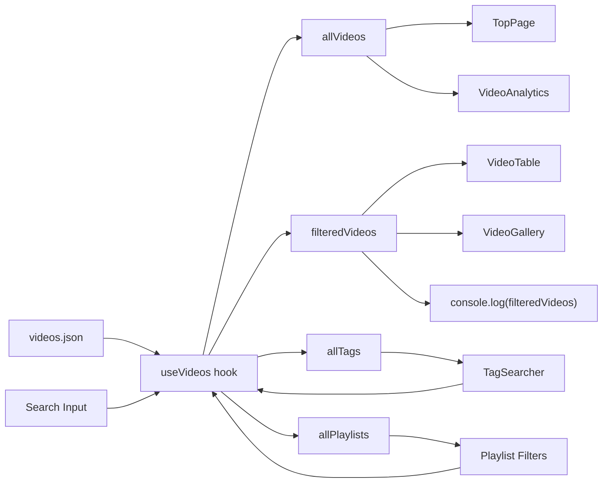
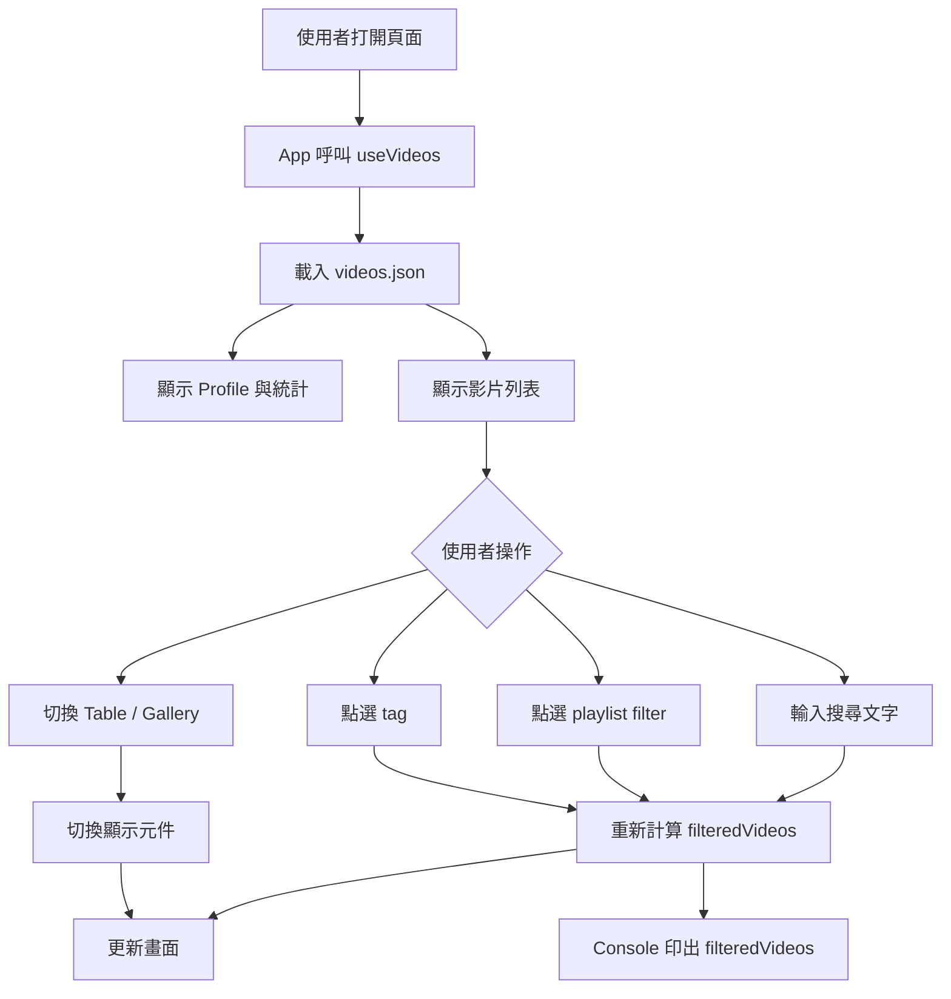

# Himari Profile React Data Flow

這份文件對應 Notion 設計書的 Phase 2：Profile + Video Block。

## 資料流

1. `src/data/videos.json`
   靜態影片資料來源。每筆資料包含 `id`、`date`、`title`、`url`、`videoId`、`thumbnailUrl`、`playlist`、`tags`、`collab`、`duration` 等欄位。

2. `src/hooks/useVideos.ts`
   集中處理影片資料狀態。

   - 讀取 `videos.json`
   - 建立 `allVideos`
   - 建立 `allTags`
   - 建立 `allPlaylists`
   - 管理 `search`
   - 管理 `selectedTags`
   - 管理 `selectedPlaylists`
   - 產生 `filteredVideos`

3. `src/App.tsx`
   頁面總控制器。

   - 呼叫 `useVideos()`
   - 將 `allVideos` 傳給 `TopPage` 與 `VideoAnalytics`
   - 將 `filteredVideos` 傳給 `VideoTable` 或 `VideoGallery`
   - 將 `allTags`、`selectedTags`、`toggleTag` 傳給 `TagSearcher`
   - 在 `useEffect` 裡執行 `console.log(filteredVideos)`

4. Components

   - `TopPage`: 顯示主視覺、Profile 概要、影片統計
   - `VideoTable`: 表格形式顯示影片
   - `VideoGallery`: 卡片形式顯示影片
   - `TagSearcher`: tag 選取與篩選入口
   - `VideoAnalytics`: playlist 分布統計
   - `FanartPreview`: Phase 4 預留區塊
   - `RelatedLinks`: 外部連結

## Console Log 寫法

`filteredVideos` 是 hook 算出來的資料，所以必須先在 `App.tsx` 呼叫 `useVideos()`。

```tsx
const { filteredVideos } = useVideos()

useEffect(() => {
  console.log(filteredVideos)
}, [filteredVideos])
```

這樣每次搜尋文字、tag、playlist 改變時，Console 都會印出最新的篩選結果。

## Mermaid 資料流圖



## 使用者操作流程圖



## Phase 對應

目前已接上的區塊：

- Phase 2: TopPage
- Phase 2: VideoTable
- Phase 2: VideoGallery
- Phase 2: VideoAnalytics
- Phase 3 前置: TagSearcher 可篩選 tag
- Phase 4 預留: FanartPreview
- Phase 5 前置: RelatedLinks

